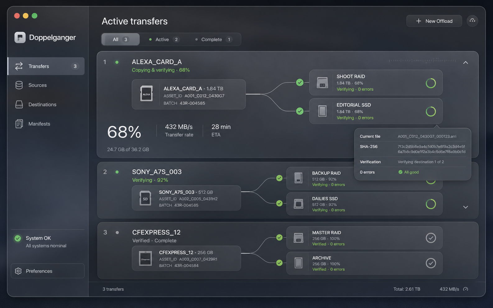

# Design Language

The MVP uses Apple's current macOS visual language, including Liquid Glass, to
make a high-stakes utility feel native and calm. Glass is an interaction and
navigation material, not the default background for every piece of data.

## Product concept

The concept establishes the overall composition: a compact macOS sidebar,
several simultaneously visible transfer cards, direct source-to-destination
topology, per-destination progress, and expandable operational detail.

It is a direction reference rather than a pixel specification. In particular,
the green checks shown on active connectors in this early concept are
superseded by the status rules below: an active copy or verification is blue or
cyan; green appears only after verification and evidence writing have passed.

## Non-negotiable visual semantics

1. **Source fans out directly.** Every destination has its own line from the
   source. Never draw `source → destination 1 → destination 2` unless a future
   cascading transfer is explicitly modeled as separate transfers.
2. **Green means verified.** Copying is blue, verification is cyan, queued and
   neutral states are gray, warnings are orange, and failed/incomplete states
   are red. Reaching 100% of the copy pass does not earn a checkmark.
3. **Failure keeps its shape.** A failed destination shows its verified
   fraction and error count; it does not jump to 100%. A card with any failure
   cannot use the quiet success treatment.
4. **Evidence affects the verdict.** A transfer whose media copied and verified
   but whose required evidence could not be written is red/failed, with the
   transfer-level issue visible in the card and report.
5. **Source safety is explicit.** Failed/interrupted cards say to keep the
   source. Eject is offered only for the removable source-volume root after a
   verified terminal result. Formatting and source deletion are absent.

## Liquid Glass usage

- Use Liquid Glass for the sidebar selection, filter chips, primary/secondary
  controls, compact icon controls, sheets, and small transient callouts.
- Use quieter opaque or system background surfaces for transfer cards,
  destination rows, manifests, preferences, and failure detail. Dense nested
  glass reduces hierarchy and legibility.
- Preferences is a dedicated in-app sidebar tab so configuration stays in the
  main workflow; `⌘,` selects that tab. Keep menus, folder pickers, keyboard
  shortcuts, and accessibility behavior native to macOS.
- Maintain contrast in light/dark appearances and Increased Contrast. Do not
  encode state with color alone; pair it with text and/or a symbol.

## Multi-task dashboard

- Default completed and background tasks to a compact row showing label,
  source, direct destination summary, truthful phase/verdict, and progress.
- Automatically expand the first running task; let the operator expand any
  task without changing its execution state.
- A task owns its own engine and evidence. The queue may run independent
  physical volumes concurrently, but it must not contend on the same source or
  destination volume.
- Reduce decorative animation frequency and honor Reduce Motion. Live motion
  communicates activity, not success.

## In-page option and filter navigation

- When a page has several peer sub-options or status filters, use the Transfers
  pattern: separate Liquid Glass capsule chips in a row beneath the page title.
  Do not substitute a joined segmented control for this pattern.
- A chip may pair its label with a small semantic-color dot and a live count.
  The selected chip uses the blue-tinted glass treatment; the status dot still
  follows the product's truthful color semantics.
- The entire visible capsule is the hit target. Selection does not change its
  padding or geometry, so the control never shifts away from the pointer.
- Reuse the same shared component, spacing, typography, and count animation on
  Transfers, Manifests, Project history, and future pages with comparable peer
  filters. A simple binary or form choice may still use the native control that
  best matches macOS conventions.

## Project context

- Project is an optional working context. Always provide a clear “No Project”
  or global “All Transfers” route rather than forcing setup before an offload.
- Show the active project near the workflow entry point so the destination of
  newly created tasks is understandable before the user presses Start.
- History can reveal a Project → Shooting Day → Camera/Card hierarchy, but each
  transfer remains independently identifiable and directly reachable.
- Moving a historical task between organizational containers must look like
  metadata organization, never like the underlying verified evidence moved or
  changed.

## New Offload review

The start sheet is a review checkpoint, not a form that launches blindly. It
must show:

- transfer/output-folder name and exact output path per destination;
- source item count and bytes;
- available capacity with working reserve;
- empty and zero-byte findings;
- source/destination overlap, existing-folder, mount, read-only, and physical
  volume independence checks;
- explicit acknowledgement for same-volume/non-independent copy warnings.

Changing any input invalidates the prior preflight. Start remains disabled
until the displayed plan matches the request exactly.

## Accessibility and performance

- Every icon-only control has a concrete accessibility label and Help text.
- Target controls are comfortably clickable; selection must not shift the hit
  area beneath the pointer.
- Text can be selected where an operator may need to report an error or path.
- Progress updates are throttled; the UI never reads free-space metadata or
  hashes files on every render pass.
- Dense task cards remain scannable at the minimum supported window size.
